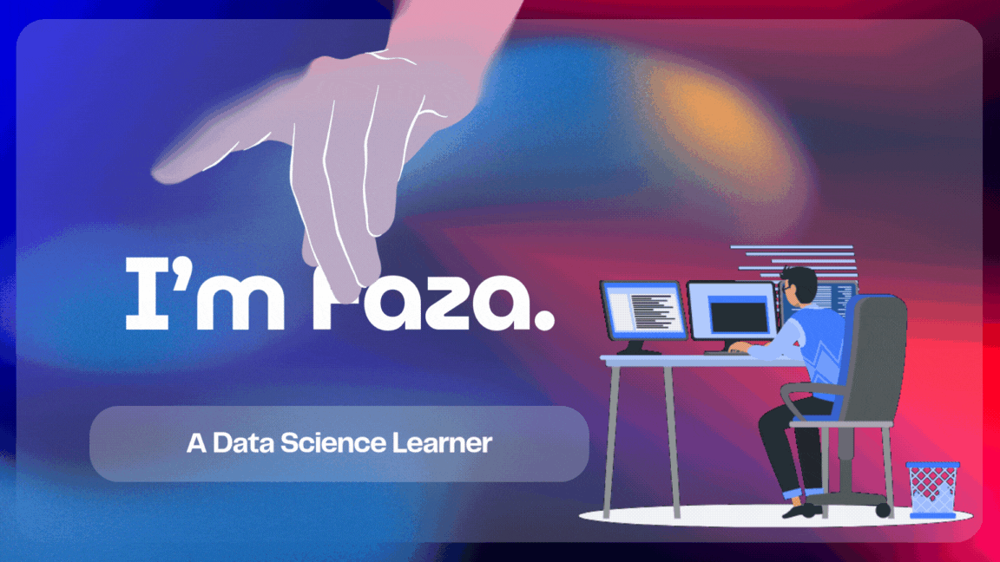

<picture>
  <source media="(prefers-color-scheme: dark)" srcset="https://raw.githubusercontent.com/fazqin/fazqin/output/pacman-contribution-graph-dark.svg">
  <source media="(prefers-color-scheme: light)" srcset="https://raw.githubusercontent.com/fazqin/fazqin/output/pacman-contribution-graph.svg">
  
</picture>

###
###  About Me

I'm a Python Programmer.
AI/ML Enthusiast and a tech enthusiast! 💻✨

- 🔭 Currently working? No, im Jobless 
- 🎓 Student at Cakrawala University
- 🤝 Looking to collaborate on projects  
- 💬 Ask me about Data or Python 
- 🌐 Pronouns: He/him  
- ⚡ Fun fact: I have a servant (GPT) wkwk  

###  Languages and Tools:

  
  
  
  
  
  
  
  

---

### 🔗 Connect with me:

# GitHub Stats:
 
 

